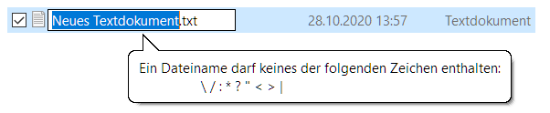

[Overview](./overview.md) | [Back (Character classes)](./char_classes.md) | [Next (Groups)](./groups.md) 

# Anchors

With anchors we can match positions. For example if we want to match specific characters only on the beginning of the line or the end of the line

The following anchors exist:

    Be aware that a position is no character
        ^    Matches on beginning of the line
        $    Matches on the end of a line
        \b   Matches on a word boundary (beginning or end of a word)
             Matches, without consuming any characters, immediately between a character 
             matched by \w and a character not matched by \w (in either order)

## Examples with anchors
```python
s = "Error on columbia01. A Fatal Error occured!"
print(re.findall(r"^Error", s))

s = "Subject: fire. Dear Sir/Madam, I am writing to inform you of a fire"
print(re.findall(r"fire$", s))

s = "A38, 42, 36, 48"
print(re.findall(r"\b[0-9]{2}\b", s))
# print(re.findall(r"[0-9]{2}", s))
```

## Exercise "valid file names" revisited

Let's take the valid file names more seriously. In Windows OS the following symbols may no be used in a file name: `\/:*?"<>|`



This means our restrictions are as followed:

- at least 1 arbitrary character except of  `\/:*?"<>|`
- followed by a dot (`"."`)
- followed by exactly 3 arbitrary characters, but not `\/:*?"<>|` 

```python
def valid_filename(filename):
    m = re.search(r"^[^\/:*?<>|]+\.", filename)
    return m is not None

assert valid_filename("test.txt") is True
assert valid_filename("1.txt") is True
assert valid_filename(".txt") is False
assert valid_filename("test") is False
assert valid_filename("test.tt") is False
assert valid_filename("test.text") is False
assert valid_filename("te:st.txt") is False
assert valid_filename("te*st.txt") is False
assert valid_filename("test.t?t") is False
print("Good RegEx")
```

## Exercise "is integer"
    is_integer(string) -> bool
    Function should evaluate if given string is a valid integer. 

    We define valid integers as this:

    Consists of 1 or more digits
    May optionally begin with -
    Does not contain any other non-digit characters.

```python
import re

def is_integer(string):
    match = re.search(r"^-?\d+$", string)
    return match is not None

assert is_integer("42") is True
assert is_integer("-5000") is True
assert is_integer("-") is False
assert is_integer(" 42") is False
assert is_integer("0.0") is False
assert is_integer("+999") is False
```


[Overview](./overview.md) | [Back (Character classes)](./char_classes.md) | [Next (Groups)](./groups.md) 