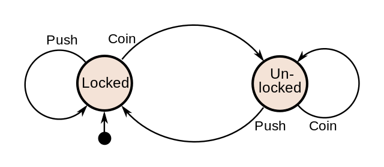

[Back](./engine.md) | [Next](./dfa.md)

# Building a NFA/DFA RegEx machine
One way to build a RegEx engine is implementing a finite state machine (FSM). 

A finite state machine consists of **states** and **events**. With events we can transmit from one state to another (or also stay in the same state). But we can only be at one state at any given time.

Let's have a look at an example. (this example is taken from the he wikipedia page about finite state machines) 

# Turnstile as a state machine
If we look at as turnstile as a state machine we come to the conclusion, that it has two states: it can be *locked* (no one can pass), or it can be *unlocked* (let exactly one person through). 

To start a transition from state *locked* to *unlocked* we need an event to occure: this event is inserting a coin. Once we inserted a coin we can get through the turnstile by pushing and therfore implicitly changing its state from *unlocked* to *locked*. 

Drawn as a state machine the descibed behaviour looks like this:

## Implementing a state machine in `python`

We now look at multiple implementations of a state machine in python. 

## A regular expression as a Finite State Machine

