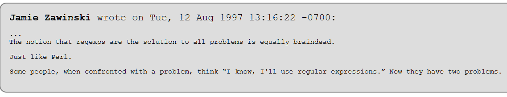

[Overview](./overview.md) | [Next (Meta characters)](./meta.md) 

# Introduction

No introduction to Regular Expressions without the famous words of Jamie Zawinski.



Regular Expressions are a powerful tool which should be in every developers toolkit. But be aware, that they are not the solution to every problem.

But what are Regular Expressions (or short: *RegEx*)?

Regular Expressions are used for matching a string within a string. With a RegEx you can:

    - check, if a string is contained in a string
    - extract information (e.g. substrings) out of a string

If we look at modern programming languages like Python, the builtin string method is already quite powerful. Let's look at some of Pythons string methods in action. 

```python
# Check if a string is contained in another string
exc = "Fatal error occured on system deathstar01"
print("Fatal error" in exc)     # prints True

ok = "Successful login on system deathstar01"
print("Fatal error" in ok)      # prints False
```
To check if a string is contained in another string is quite easy in Python. We can use the `in` keyword for that. It is also quite easy to check, if a string starts or ends with a specific string.

```python
# Check if a string starts with a specific string
s = "Hello World"
print(s.startswith("Hello"))            # case sensitive
print(s.lower().startswith("hello"))    # case insensitive
```

Even more complex checks are possible without the use of RegEx. Have a look at this example

```python
# Check if we have a vowel in the passed string
def has_vowel(s):
    # case sensitive
    return "a" in s or "e" in s or "i" in s or "o" in s or "u" in s 

print(has_vowel("Hello World"))     # prints True
print(has_vowel("zzz"))             # prints False

# Use of a generator expression with built-in `any` function
# for a more dense syntax
print("-- Generator Usage --")
print(any(c in "Hello World" for c in 'aeiou'))
```

## Limitations
The shown examples are quite simple but show the usage of builtin functions and methods of the Python string object well. The solutions are not only restricted to Python, similar methods exists in most other modern Programming Languages like Java or C++. 

So in most cases we are good to go when we use what's available in our string methods and ignore RegEx at all. 

But there are also cases were we reach the limit of what is possible with builting methods. Here are some examples. What if:

- We want to match an arbitrary character
- We want to have 0..x matches of a specific character or word
- We want to specifiy the position of the match. E.g. at the beginning of the row, end of the row, or word boundary

Then ... well ... we need to:


Let's dive into this topic by introducting `meta characters`. 

[Overview](./overview.md) | [Next (Meta Characters)](./meta.md) 