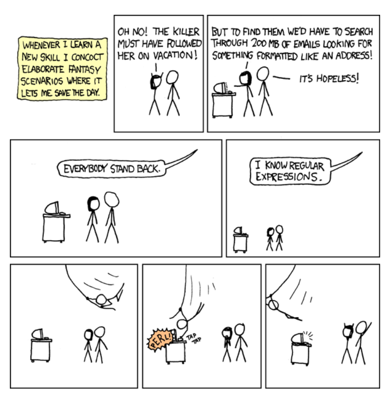

[Overview](./overview.md) | [Back (Meta-Characters)](./meta.md) | [Next (Character classes)](./char_classes.md) 

# Quantifiers

In the last exercise we wrote a filename validator which might look like this: `r"........\...."`. We had 8 arbitrary characters followd by a literal dot followed by 3 arbitrary characters. 

This is kind of hard to read. So there must be a better way to specify how many times we want a character or meta character to match. 

With *quantifiers* we can specify exactly that. We can tell the RegEx how often a (Meta-)Character must match. 

The following quantifiers are available:
```
    *        0..x
    +        1..x
    ?        0..1
    {3}      exactly 3 
    {42}     exactly 42
    {3,}     3..x
    {10,20}  10..20
```

A quantifier must be places behind the match character. So in our previous exercise we could simplify the regex like this: 

```python
import re

def simple_validator(filename):
    # Replace ... with valid RegEx
    m = re.search(r".{8}\..{3}", filename)
    return m is not None
```

Match an arbitrary character exactly 8 times, than match a dot and than match an arbitrary character exactly 3 times. 

Yeeih! That's cool! Let's have a closer look on some other quantifiers.

## `*` quantifier
The `*` quantifier specifies that an character may have any number of hits. Any number means **zero** hits, as well as 1.000.000 hits, as well as 40 hits, as well as ... I think you get it.

```python
# * matches 0..x

print(1, re.search(r"abc.*", "abc"))            # matched abc
print(2, re.search(r"abc.*", "abcd"))           # matched abcd
print(3, re.search(r"abc.*", "abcdefghijklmz")) # matched abcdefghijklmz
```

Try to figure out if the following statements are a match, or no match. You can test your results afterwards

```python
# {3} matches exactly 3 times
# {3, } matches 3..x times

print(4, re.search(r"a.{3}z", "abz"))           # Match or no match?
print(5, re.search(r"a.{3,}z", "abcdz"))        # Match or no match?
print(6, re.search(r"a.{3,}z", "abcdedfgz"))    # Match or no match?
```

## `+` and `?` quantifier
The `+` quantifier specifies that an character may have one to any number of hits. So we must have **at least** 1 hit. 

Look at these examples. Will they match?
```python
# + matches 1..x times

print(7, re.search(r"a.+z", "abz"))     # Match or no match?
print(8, re.search(r"a.+z", "az"))      # Match or no match?
```

For a character marked with the `?` quantifier to be matched, it must appear exactly once or must not appear. So it marks something as *optional*.

```python
# ? matches 0..1 times

print(9, re.search("a.?z", "abz"))      # Match or no match?
print(10, re.search("a.?z", "az"))      # Match or no match?
print(11, re.search("a.?z", "abcz"))    # Match or no match?
```

## Exercise 
Let's revisit the valid filename exercise again.

A valid filename is now specified as this:

- at least 1 arbitrary character
- followed by a dot "`.`"
- followed by at least 3 arbitrary characters

```python
import re
# Validate file names

def valid_filename(filename):
    # Replace ... with valid RegEx
    m = re.search(r"...", filename)
    return m is not None

assert valid_filename("test.txt") is True
assert valid_filename(".txt") is False
assert valid_filename("test") is False
assert valid_filename("test.tt") is False
assert valid_filename("test.text") is True
print("Good RegEx!")
```

## Exercise II: "Valid emails"
In this simplified example we want to validate emails. In our example a valid email is definied as followed:

- at least 1 arbitrary character
- followed by an "`@`" symbol
- followed by at least 3 arbitrary characters
- followed by a dot "`.`"
- followed by at least 2 arbitrary characters

*Please be aware that validating email is a lot more complex in real world. This is just a simplfied version. So do not use this validator in production code! ;)* 

```python
import re

def bad_email_validator(email):
    # Replace ... with valid RegEx
    m = re.search(r"...", email)
    return m is not None

assert bad_email_validator("peter@gmail.com") is True       # valid
assert bad_email_validator("petergmail.com") is False       # invalid
assert bad_email_validator("@xyz.com") is False             # invalid
assert bad_email_validator("hugo@.com") is False            # invalid
print("Good RegEx!")
```

We are well on the way to becoming a RegEx Hero!



[Overview](./overview.md) | [Back (Meta-Characters)](./meta.md) | [Next (Character classes)](./char_classes.md) 