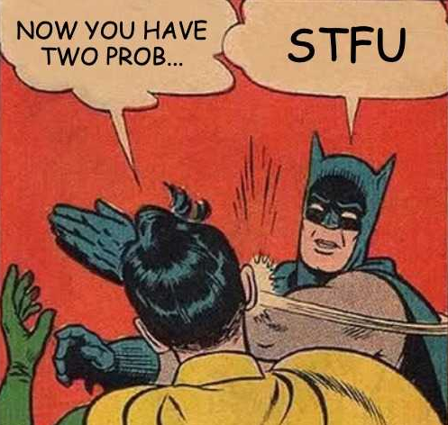

[Overview](./overview.md) | [Back (Lookaround)](./lookaround.md) 

# Substitution

So far we have used RegEx to validate if certain strings match defined criteria. But we can use RegEx also in a way to substitute certain matches with something else. 

This is very useful so we get practical an have a look at an example.

## Example

Let's say we have converted a lot of images from the jpg-format to a png-format. If the images are used in a HTML homepage they are referenced in our source code with the old filename. 

To avoid manual tedious work to replace every filename by hand we want the fileending to be programatically changed. 

We could use the `str.replace` method for that in python.

```python
filenames_jpg = [
    "test.jpg",
    "home.jpg",
    "index.jpg"
]

filenames_png = [s.replace("jpg", "png") for s in filenames_jpg]
print(filenames_png)

```
But what if we have not only converted files with the ending `jpg` but also files with ending `jpeg` and `bmp` got converted to `png`?

Things get ugly if we keep on repeating the `str.replace` method with different endings, so there must be a better way!

And of course there is by using RegEx. We use the `re.sub` method in Python for that. This will look like this:

```python
import re

filenames_mixed = [
    "test.jpg",
    "home.jpg",
    "index.jpg",
    "sell.png",
    "passwort.bmp",
    "holiday.jpeg"
]

filenames_png = []
for file in filenames_jpg:
    # re.sub(pattern, replace, string)
    png_file = re.sub(r"(\w+)\.(jpg|png|jpeg|bmp)", r"\1.png", file)
    filenames_png.append(png_file)

print(filenames_png)
```
Let's examine the `re.sub` command.

- First we created a capturing group matching any word character `(\w+)`
- This got followed by a literal dot `\.`
- Followed by a group alternation for different file endings `(jpg|png|jpeg|bmp)`

Now comes the interesting part. We referenced our first group in our replacement string by using `\1`. Every opening group can be referenced again by a group number starting from 1. 

So we substitute our match with the content of the first capturing group (the filename without ending), followed by a literal dot and the file ending png. 

That gives us a lot more possibilities and we will practice this soon. Before that just a word about non-capturing groups.


# Exercise

We want to practice the substitute feature. In this exercise we want to fix the occurences like this:

```python
import re

def fix_string(string):
    # replace pattern and replace here
    return re.sub(r"...", r"...", string)

assert fix_string("This is Tunas pencil") == "This is Tuna's pencil"
assert fix_string("This is Tunas laptop") == "This is Tuna's laptop"
assert fix_string("Tunas laptop is broken") == "Tuna's laptop is broken"
assert fix_string("My name is Tuna") == "My name is Tuna"
assert fix_string("Tuna, what's wrong with you?!") == "Tuna, what's wrong with you?!"
print("Good RegEx")
```


## Non-capturing groups
Groups are capturing by default, this means every group we create can be referenced.

If this behaviour is not desired we can specifiy a group as a non capturing group if we define the group like this: `(?:)`. These groups cannot be back-referenced any more. This feature is more like a documentational feature if we want to make clear, that this match will not be referenced or needed later on. 

# Exercise

We now combine the substituion command with features we learned several chapters ago in this real-world exercise. 

A html homepage consists typically of several html files and also some image files. In our example most of the html files are in the same directory as the image files. 

Within the html files the images get referenced like this:

```python
html_string = ''
html_string += ''
html_string += '<a href="index.html" class="brand-logo left"></a>'
```
As you see in the `src` attribute, some file paths to the png files are in the same directory level as the html file (no path is prepended, like `python.png`), other images are located in the `images` directory. This mixup is no good style. We fix this by moving every image file to an image directory, if not already there.

By moving the files on the harddisk we now have to change every image tag, too. What makes things even worse is, that some images already are in the image directory. Because our homepage has quite a lot of images it is not practical to change every `src-tag` by hand. And since we know RegEx we use our new super power :)

So we want the content of the src-tag to be changed like this:

| `old src`               | `new src`                     | `comment`|
|:-----------------------:|:-----------------------------:|---------|
| src="pic.png"           |  src="images/pic.png"         | change
| src="python.png"        |  src="images/python.png"      | change
| src="python.jpeg"       |  src="images/python.jpeg"     | change
| src="images/idx.jpeg"   |  src="images/idx.jpeg"        | **no change**
| src="images/test.jpg"   |  src="images/test.jpg"        | **no change**


At this point our RegEx toolkit is well equiped so we can solve this problem in multiple ways. So there is no "single correct solution". 

Try to find a solution for this real world scenario.

```python
import re

lines = [
    'src="pic.png"',
    'src="python.png"',
    'src="python.jpeg"',
    'src="overview.jpeg"',
    'src="images/idx.jpeg"',
    'src="images/test.jpg"',
]

fixed = []
for line in lines:
    # replace search and replace here
    fix = re.sub(r'...', r'...', line)

    # uncomment this line if debugging
    # print(fix)
    fixed.append(fix)

assert fixed[0] == 'src="images/pic.png"'
assert fixed[1] == 'src="images/python.png"'
assert fixed[2] == 'src="images/python.jpeg"'
assert fixed[3] == 'src="images/overview.jpeg"'
assert fixed[4] == 'src="images/idx.jpeg"'
assert fixed[5] == 'src="images/test.jpg"'
print("Good RegEx")
```

*Hint*: If you are using RegEx101 to "debug" your RegEx creation, use this as test string:

```
'src="pic.png"'
'src="python.png"'
'src="python.jpeg"'
'src="images/idx.jpeg"'
'src="images/test.jpg"'
```

# The End

This is the end of our RegEx journey. I hope you had some fun learning RegEx. You are now prepared to solve real world problems with the power of RegEx. 



[Overview](./overview.md) | [Back (Lookaround)](./lookaround.md) 